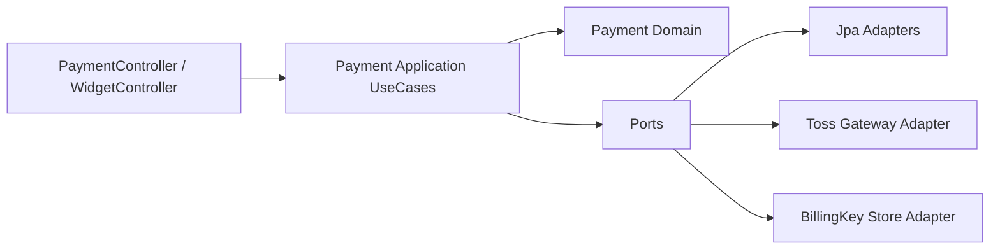
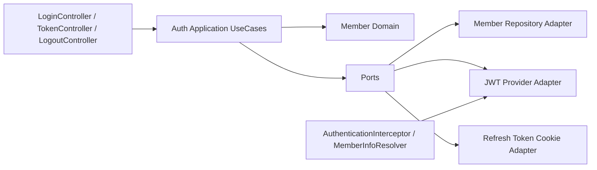

# P2 Kotlin Pilot Domain Boundaries

## Decision

- Primary pilot slice: `payment`
- Secondary pilot slice: `auth/token`
- Kotlin migration entry point: `application` and `infra adapter` layers first
- Explicit non-goal for the first pilot: converting controllers or JPA entities to Kotlin before the boundaries are cleaned up

The current codebase mixes HTTP transport, token/cookie handling, vendor SDK concerns, transaction orchestration, and domain state changes in the same classes. The first Kotlin pilot should therefore start after each slice has a stable `controller -> application -> domain -> infra` boundary.

## Boundary Rules

- `controller/presentation`
  Handles HTTP request/response, header parsing, cookie extraction, JSON binding, status codes, and view rendering only.
- `application/service`
  Owns use-case orchestration, transaction boundaries, authorization flow coordination, and calls to domain objects or outbound ports.
- `domain`
  Owns entities, enums, invariants, domain policies, and state transitions. No servlet APIs, `JSONObject`, raw JWT parsing libraries, or external payment APIs.
- `infra`
  Owns JPA repositories, external HTTP clients, JWT implementation details, cookie implementation details, Spring interceptors/resolvers, and configuration-backed adapters.

## Why These Two Slices

- `payment` already has a meaningful business transaction boundary and an external gateway dependency.
- `auth/token` already has clear request flows, high test value, and multiple responsibilities that can be separated into ports/adapters.
- Both slices are smaller than a full module split but meaningful enough to validate Kotlin interop in production code.

## Current Slice Inventory

### Payment

| Current file | Current responsibility | Target layer |
| --- | --- | --- |
| `api/payment/controller/PaymentController.java` | HTTP endpoint, request parsing, Toss key selection, vendor URL routing, in-memory billing key state, use-case invocation | `presentation` |
| `api/payment/controller/WidgetController.java` | Alternate payment confirmation endpoint and direct Toss call | `presentation` |
| `api/payment/service/PaymentService.java` | Payment save orchestration, member lookup, budget deduction, transaction boundary | `application` |
| `api/payment/service/TossPaymentHttpClient.java` | Raw HTTP adapter to Toss Payments | `infra` |
| `api/payment/repository/PaymentRepository.java` | JPA persistence | `infra` |
| `domain/payment/entity/Payment.java` | Payment record entity | `domain` |
| `global/config/TossPaymentConfig.java` | Payment gateway configuration | `infra` |
| `global/resolver/memberInfo/*` | Authenticated member extraction used by payment endpoints | `infra` |

### Auth / Token

| Current file | Current responsibility | Target layer |
| --- | --- | --- |
| `api/login/controller/LoginController.java` | Join/login HTTP endpoints | `presentation` |
| `api/token/controller/TokenController.java` | Refresh-token cookie read/decrypt + use-case invocation | `presentation` after cookie work is moved out |
| `api/logout/controller/LogoutController.java` | Logout endpoint + authorization header parsing | `presentation` |
| `api/login/service/LoginService.java` | Join/login orchestration, password encoding, token issuance, refresh token update | `application` |
| `api/token/service/TokenService.java` | Refresh flow orchestration, cookie write, member lookup | `application` |
| `api/logout/service/LogoutService.java` | Logout orchestration, access token validation, refresh token expiration | `application` |
| `api/login/validator/LoginValidator.java` | Duplicate email validation | fold into `application` or `domain policy` |
| `domain/member/entity/Member.java` | Member aggregate, refresh token state mutation | `domain` |
| `domain/member/service/MemberService.java` | Member lookup/register/update orchestration | split into domain-facing port usage + `application` support |
| `domain/member/repository/MemberRepository.java` | JPA persistence | `infra` |
| `global/jwt/service/TokenManager.java` | JWT issuance and cookie write | split: token issuance to `infra`, cookie write to `infra` |
| `global/util/JwtUtils.java` | JWT validation/parsing | `infra` |
| `global/jwt/service/CookieService.java` | Cookie write/delete implementation | `infra` |
| `global/interceptor/AuthenticationInterceptor.java` | Access token validation at web boundary | `infra` |
| `global/interceptor/AdminAuthorizationInterceptor.java` | Role authorization at web boundary | `infra` |
| `global/resolver/memberInfo/MemberInfoArgumentResolver.java` | Authenticated member extraction from JWT claims | `infra` |
| `global/util/AuthorizationHeaderUtils.java` | Header parsing utility | `presentation` helper or `infra security` |

## Payment Slice: Current Problems

- `PaymentController` decides which Toss key to use by inspecting the request path.
- `PaymentController` owns `billingKeyMap`, which is application state stored inside a controller instance.
- `PaymentController` and `WidgetController` both know Toss API URLs and both call the gateway directly.
- `PaymentService` consumes raw `JSONObject`, which leaks vendor response shape into the service boundary.
- `PaymentRepository` lives under `api`, while `Payment` entity lives under `domain`.
- `CardRepository` is injected into `PaymentController` but is not part of the confirmed payment flow.

## Payment Target Boundary



### Payment presentation

- `PaymentController`
- `WidgetController`
- Request/response DTOs replacing raw `JSONObject` input at the controller boundary

Responsibilities:

- Bind request body and query params
- Convert HTTP payload into application command objects
- Return HTTP status and JSON/view response only

### Payment application

Recommended initial use cases:

- `ConfirmPaymentUseCase`
- `ConfirmBillingUseCase`
- `IssueBillingKeyUseCase`
- `ConfirmBrandpayUseCase`

Responsibilities:

- Choose correct payment workflow
- Open transaction boundary
- Call outbound payment gateway port
- Persist payment result
- Coordinate member budget deduction

### Payment domain

Recommended core concepts:

- `Payment` entity
- `PaymentStatus` / `PayType` enums if they remain business concepts
- `Member` budget mutation rule
- Optional domain policy: `BudgetPolicy` or `PaymentApprovalPolicy`

Domain rules that should live here:

- budget cannot go below zero
- payment record should only be stored for confirmed payments

### Payment infra

Recommended adapters:

- `TossPaymentGatewayAdapter`
- `JpaPaymentRepositoryAdapter`
- `JpaMemberRepositoryAdapter`
- `InMemoryBillingKeyStore` first, then Redis-backed adapter later
- `TossPaymentProperties`

### Payment Kotlin pilot sequence

1. Keep `PaymentController` and `Payment` entity in Java.
2. Introduce Kotlin `application` command/result classes and use cases.
3. Move `TossPaymentHttpClient` behind a Kotlin gateway adapter.
4. Move repository access behind ports/adapters.
5. Only after that decide whether `Payment` entity itself should move to Kotlin.

## Auth / Token Slice: Current Problems

- `TokenController` decrypts the cookie itself before it calls the service.
- `TokenManager` issues JWTs and also writes cookies, so token issuance and transport are coupled.
- `JwtUtils`, `TokenManager`, `AuthenticationInterceptor`, and `MemberInfoArgumentResolver` all parse/validate overlapping token concerns.
- `LogoutController` parses the authorization header manually before delegating.
- `LoginValidator` duplicates member lookup behavior that already belongs near join/login application flow.
- `Role.from()` silently defaults to `USER`, which is dangerous at the auth boundary.

## Auth / Token Target Boundary



### Auth presentation

- `LoginController`
- `TokenController`
- `LogoutController`

Responsibilities:

- Accept HTTP requests
- Read transport-level cookies and headers only through shared presentation helpers
- Pass pure command objects into application services
- Return response DTOs only

### Auth application

Recommended use cases:

- `JoinUseCase`
- `LoginUseCase`
- `RefreshAccessTokenUseCase`
- `LogoutUseCase`

Responsibilities:

- validate join/login request
- call password encoder
- call token provider port
- update member refresh token state
- decide cookie write/remove actions through an outbound port

### Auth domain

Primary domain object:

- `Member`

Rules that belong here or next to it:

- refresh token state update
- refresh token expiration state change
- role semantics

Avoid putting these in domain:

- servlet request/response
- raw cookie decryption
- JWT library objects such as `Claims`

### Auth infra

Recommended adapters:

- `JwtTokenProvider` replacing the split between `TokenManager` and `JwtUtils`
- `RefreshTokenCookieManager`
- `JpaMemberRepositoryAdapter`
- `BearerTokenExtractor`
- `AuthenticatedMemberResolver`

Spring web/security concerns that should remain infra:

- `AuthenticationInterceptor`
- `AdminAuthorizationInterceptor`
- `MemberInfoArgumentResolver`

### Auth / Token Kotlin pilot sequence

1. Keep controllers and interceptors in Java.
2. Introduce Kotlin use cases for join/login/refresh/logout.
3. Merge JWT issuance and parsing behind a Kotlin `JwtTokenProvider` adapter.
4. Move cookie encryption/write/remove into a dedicated adapter.
5. Reduce controllers to request mapping only.

## Recommended Package Shape After Boundary Cleanup

```text
com.app.payment
  presentation
  application
  domain
  infra

com.app.auth
  presentation
  application
  domain
  infra

com.app.member
  domain
  infra
```

Notes:

- `member` should remain its own domain because both `payment` and `auth` depend on it.
- `payment` should not own JWT/cookie details.
- `auth` should not own vendor payment gateway concerns.

## Concrete Refactor Targets

### Payment

- Move `billingKeyMap` out of `PaymentController`
- Replace `JSONObject` service input/output with application DTOs
- Remove Toss URL/secret-key branching from controller
- Introduce repository and gateway ports
- Remove unused `CardRepository` dependency from payment presentation if not needed

### Auth / Token

- Move cookie decrypt logic out of `TokenController`
- Split `TokenManager` into token provider and cookie adapter responsibilities
- Collapse `LoginValidator` into join/login application flow
- Replace direct `Claims` handling outside infra/security layer
- Make role parsing fail fast instead of silently defaulting

## Kotlin Pilot Start Line

Start here after package cleanup:

1. `payment.application`
2. `payment.infra.toss`
3. `auth.application`
4. `auth.infra.jwt`

Do not start with:

- controllers
- JPA entities
- interceptors

That keeps the first Kotlin increment small, interoperable with Java, and aligned with real business boundaries instead of framework boundaries.
